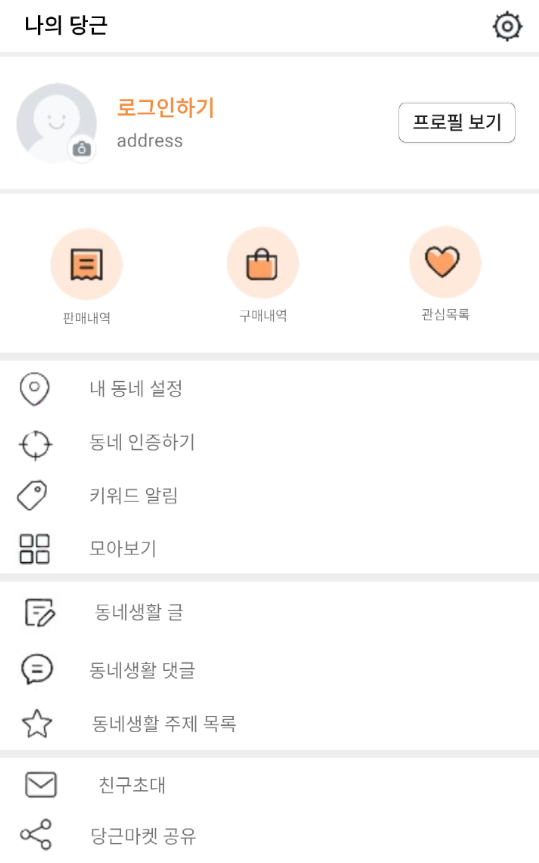
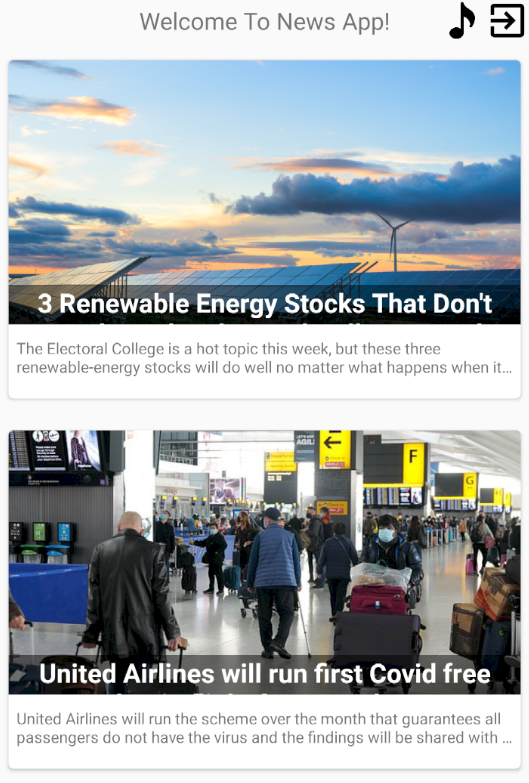
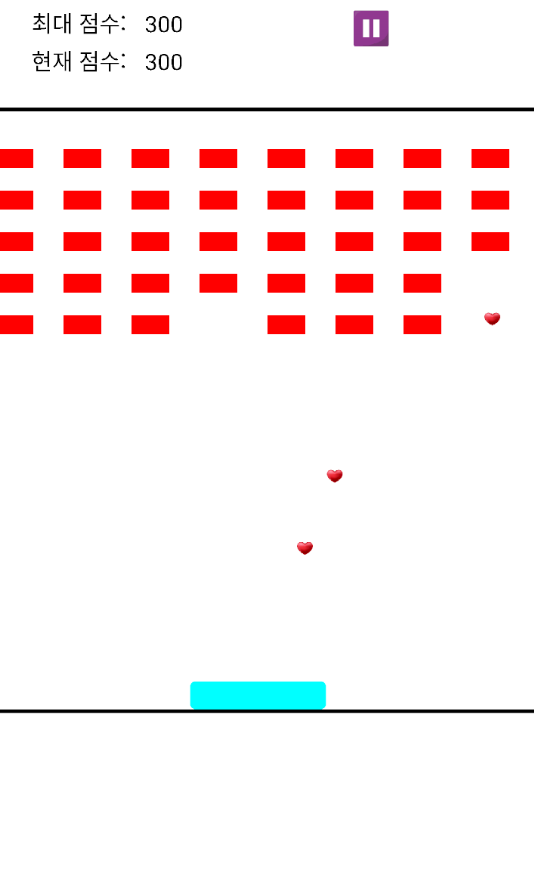
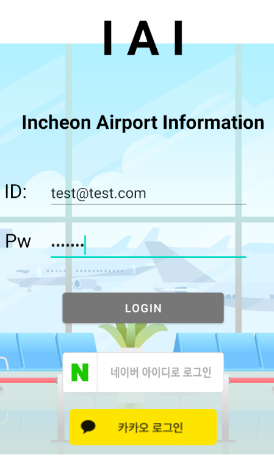

# SoftSquared Android 1:1 Session

## 1week

- Manifest / Intent / 4대 구성요소 조사

## 2week
### 당근마켓의 설정화면을 클론코딩해봤습니다

 

## 3week, 4week, 5week
### 뉴스 api를 받아와서 json을 활용하여 CRUD기능을 가진 뉴스앱을 완성했습니다.

## 6week, 7week, 8week
### 스레드를 활용하여 블록깨기 게임을 만들었습니다.

## 9week
Open Api및 Okhttp3통신을 통해 인천공항 비행기 입출국 정보를 가져와서 만들었습니다.

